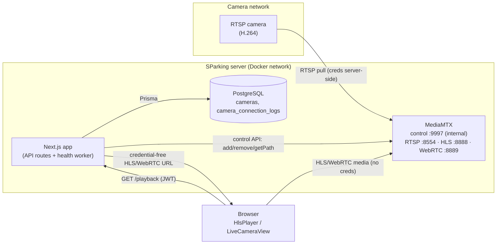
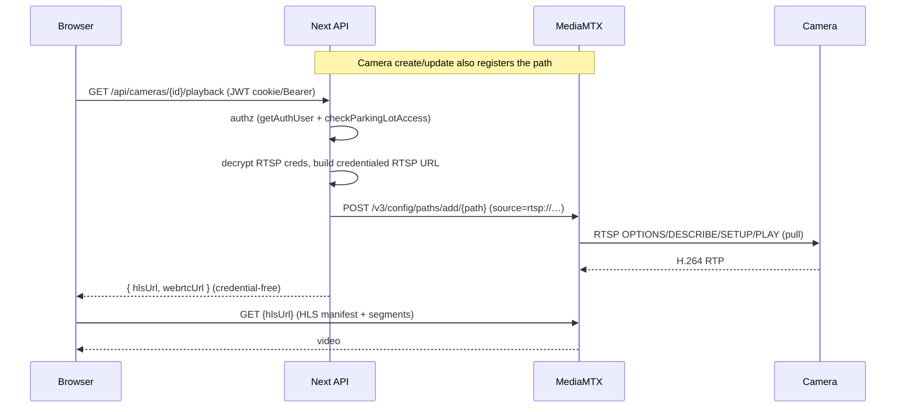

# CCTV Architecture

## Components



**Key invariant:** the browser talks to the app for a credential-free URL, then
pulls media from MediaMTX directly. RTSP credentials never leave the server.

## Layers & responsibilities

| Layer | File(s) | Responsibility |
|-------|---------|----------------|
| Provider interface | `providers.ts` | The seam business logic depends on. Swappable. |
| MediaMTX client | `mediamtx-client.ts` | HTTP calls to the control API. |
| MediaMTX provider | `mediamtx-provider.ts` | Implements `StreamProvider` over the client. |
| Orchestration | `camera-stream.service.ts` | register/unregister/playback used by routes; writes logs + events. |
| Health worker | `camera-health.service.ts` + `workers/camera-health.ts` | Polls liveness, reconciles status/metrics/logs, emits events. Decoupled from HTTP. |
| Events | `events.ts` | In-process bus → Socket.IO today; AI/recording tomorrow. |
| API | `app/api/cameras/**` | Auth, tenant isolation, credential handling. |
| UI | `HlsPlayer.tsx`, `LiveCameraView.tsx` | Playback (HLS default, WebRTC optional). |

## Sequence — register & play



## Sequence — health reconciliation

```mermaid
sequenceDiagram
  participant W as Health worker
  participant M as MediaMTX
  participant DB as PostgreSQL
  participant S as Socket.IO

  loop every CAMERA_HEALTH_POLL_INTERVAL_MS
    W->>DB: list active cameras
    loop per camera
      W->>M: GET /v3/paths/get/{path}
      M-->>W: { ready: bool } | 404
      alt status changed
        W->>DB: update status + metrics; insert connection_log
        W->>S: emit camera.online/offline
      else no change
        W-->>W: skip (no log churn)
      end
    end
  end
```

## Design decisions

1. **HLS primary, WebRTC optional.** HLS is universally supported and robust
   (~2s with low-latency variant). WebRTC (WHEP) is kept on the *same* MediaMTX
   path for a low-latency/mobile option, toggled in `LiveCameraView`.
2. **Backend pulls RTSP.** MediaMTX connects to the camera; credentials stay
   server-side. Works when the server can reach the camera (same LAN / reachable
   IP). Remote/NAT cameras are Phase 2 (edge-agent) — see future-architecture.md.
3. **Provider abstraction.** `StreamProvider` isolates MediaMTX so it can be
   swapped (cloud/VMS/cluster) without touching routes or the health worker.
4. **Decoupled health worker.** Owns its own lifecycle; bootstrapped by Next
   instrumentation today, liftable to a standalone process. No HTTP coupling.
5. **Transition-only logging.** Status/logs are written only on state change, so
   steady state produces no churn.
6. **Idempotent provider ops.** `register`/`unregister` are safe to call
   repeatedly (create, update, and playback all call register).

## Multi-tenancy

Every camera endpoint resolves the user via `getAuthUser` and enforces
`checkParkingLotAccess` (SUPER_ADMIN bypasses). A user can only see/stream
cameras in their organization's parking lots.

## Data model additions

- `Camera.mediaMtxPath` — the MediaMTX path (defaults to camera id).
- `Camera.reconnectCount / lastOnlineAt / lastOfflineAt / avgLatencyMs / bitrateKbps` — metrics (structured now; populated incrementally).
- `CameraConnectionLog` — append-only lifecycle log (cascade on camera delete).
