# SParking Edge Agent — Software & Networking Architecture

The SParking Edge Agent bridges CCTV cameras on a customer's private network to the SParking cloud. It runs on a machine inside the camera LAN, reads each camera over RTSP, and publishes the video outbound over HTTP(S) to a cloud ingest endpoint that the portal serves to browsers.

This document describes how the Edge Agent works: the components, the network paths and protocols, the ports and traffic direction, credential handling, multi-camera concurrency, failure handling, configuration, security, diagnostics, and capacity. Where a capability is not implemented, it is called out as "Not part of the current Edge Agent."

---

## Table of Contents

1. [Executive Summary](#1-executive-summary)
2. [What Problem the Edge Agent Solves](#2-what-problem-the-edge-agent-solves)
3. [High-Level Architecture](#3-high-level-architecture)
4. [Complete A–Z Architecture Diagram](#4-complete-az-architecture-diagram)
5. [Customer-Site Network Architecture](#5-customer-site-network-architecture)
6. [Camera → Edge Agent Architecture](#6-camera--edge-agent-architecture)
7. [Edge Agent Internal Software Architecture](#7-edge-agent-internal-software-architecture)
8. [Multi-Camera Concurrency Model](#8-multi-camera-concurrency-model)
9. [Video Data Flow: CCTV → Cloud → Browser](#9-video-data-flow-cctv--cloud--browser)
10. [Networking Architecture](#10-networking-architecture)
11. [Firewall / NAT / Port Requirements](#11-firewall--nat--port-requirements)
12. [Control Plane vs Data Plane](#12-control-plane-vs-data-plane)
13. [GUI ↔ Worker Architecture](#13-gui--worker-architecture)
14. [Runtime State Machine](#14-runtime-state-machine)
15. [Camera Failure / Reconnect / Watchdog Flow](#15-camera-failure--reconnect--watchdog-flow)
16. [Configuration & Startup](#16-configuration--startup)
17. [Security Architecture](#17-security-architecture)
18. [Diagnostics & Operations](#18-diagnostics--operations)
19. [Resilience Architecture](#19-resilience-architecture)
20. [Capacity & Performance](#20-capacity--performance)
21. [Architecture Validation / Testing Evidence](#21-architecture-validation--testing-evidence)
22. [End-to-End A–Z Flow](#22-end-to-end-az-flow)
23. [Common Questions](#23-common-questions)
24. [Current Limitations / Explicit Non-Goals](#24-current-limitations--explicit-non-goals)
25. [Glossary](#25-glossary)

---

## 1. Executive Summary

The Edge Agent is a small program that runs on a **customer-owned machine inside the same local network as the CCTV cameras**. It reads each camera’s video over **RTSP** and re-publishes that video **outbound over HTTP(S)** to a cloud ingest endpoint, from which the SParking portal serves it to browsers. In the current deployment the portal and the ingest endpoint are the **same Vercel application**.

The single most important architectural property, from a networking standpoint:

> **All connections that leave the customer site are *outbound*. The cloud never initiates a connection back into the customer network. No inbound firewall rule, port-forward, public IP, or VPN is required at the customer site for the Edge Agent to work.**

The Edge Agent exists precisely so the browser (and the cloud) never has to reach into the customer’s private camera network. It is the bridge.

Key facts, all confirmed in the implementation:

| Property | Value |
|---|---|
| Camera protocol | RTSP, pulled over **TCP** (`-rtsp_transport tcp`) |
| Publish transport | **HLS-over-HTTP-PUT** — ffmpeg writes HLS segments and uploads each via HTTP `PUT` |
| Publish direction | **Outbound only** from the customer site |
| Cloud→edge connections | **None required** |
| Camera credentials | Stay on the edge machine; **never** sent to the browser |
| Concurrency model | One OS-independent goroutine per camera, one ffmpeg child per camera |
| Fault isolation | One camera failing never stops another |
| Local control API | Bound to **127.0.0.1 only**, protected by a per-run token |

---

## 2. What Problem the Edge Agent Solves

CCTV cameras and NVRs at a customer site live on a **private LAN** and use **private IP addresses** (e.g. `192.168.x.x`, `10.x.x.x`, `172.16.x.x`). These addresses are not routable from the public Internet. The customer’s router performs **NAT** (Network Address Translation), and in many cases the ISP adds **CGNAT** (Carrier-Grade NAT), which makes inbound port-forwarding impossible even if the customer wanted it.

This means the cloud **cannot** connect *in* to a camera. The only direction that reliably works from any site, behind any home or business router, is **outbound**: the site reaches *out* to the cloud.

The Edge Agent is the component that turns an unreachable, private camera stream into an outbound-published cloud stream:

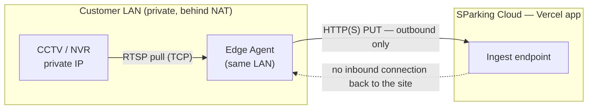

The dotted line is deliberately shown as **not used**: nothing in the cloud dials back into the site.

---

## 3. High-Level Architecture

Four zones, read left to right. The **Edge Agent** and the **cameras** sit in the customer’s private network; everything past the router is public Internet and cloud.

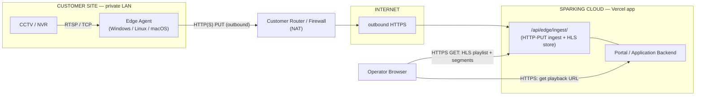

Three distinct traffic types travel over this path; they are separated throughout this document:

- **Video (data plane):** camera → Edge Agent → cloud ingest → browser.
- **Control/configuration (control plane):** local operator → GUI → local control API → worker. This is **local to the edge machine** and does not traverse the Internet.
- **Browser traffic:** operator’s browser → cloud portal (to get a playback URL) and → cloud ingest (to fetch the HLS video). This does **not** touch the customer’s camera LAN.

---

## 4. Complete A–Z Architecture Diagram

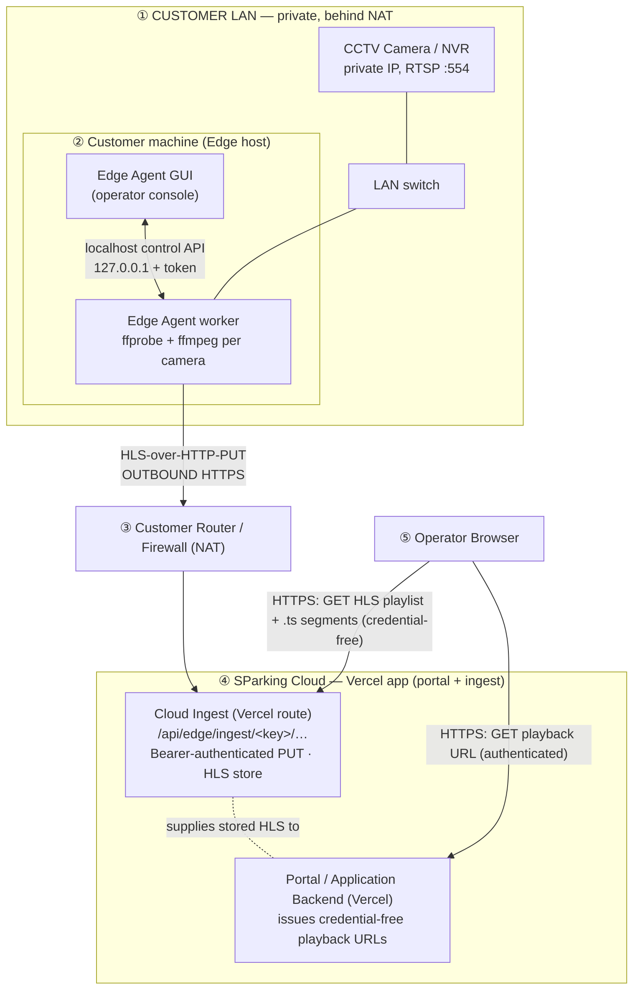

**Zone membership:**

| # | Zone | Components |
|---|---|---|
| ① | Customer LAN | Cameras/NVR, LAN switch |
| ② | Customer machine | Edge Agent worker, Edge Agent GUI |
| ③ | Boundary | Customer router / firewall (NAT) |
| ④ | Cloud (Vercel app) | Ingest endpoint + HLS store, Portal/application backend — both served by the same Vercel application |
| ⑤ | Anywhere | Operator browser |

---

## 5. Customer-Site Network Architecture

Inside the customer site, the cameras and the Edge Agent share one **LAN** (Local Area Network) — the private network behind the customer’s router.

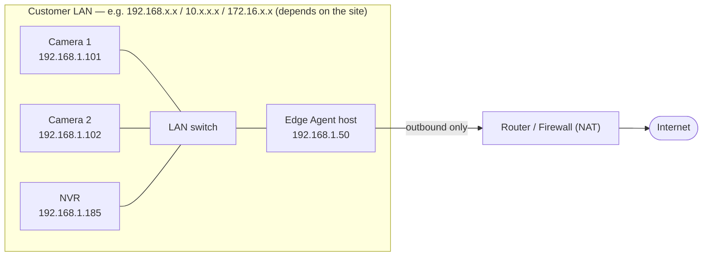

Networking notes:

- The subnet shown (`192.168.1.x`) is **illustrative only**. The actual subnet is whatever the customer’s LAN uses and is a **deployment-dependent value** — the Edge Agent does not assume or require any particular range.
- Cameras use **private IP addresses** and are normally **not exposed to the public Internet**. That is the correct and desired posture — the Edge Agent does not change it.
- The Edge Agent **must be installed on a machine inside this same reachable network**, because RTSP to a private camera IP only works from within (or routable to) that LAN. A cloud server on the public Internet cannot reach `192.168.1.101`.
- Cameras may be a mix of direct IP cameras and channels behind an **NVR**. The Edge Agent supports both: a full `rtsp://…` URL per camera, or an `rtspTemplate` with `{channel}`/`{subtype}` placeholders for NVR-style addressing.

---

## 6. Camera → Edge Agent Architecture

**RTSP** (Real-Time Streaming Protocol) is the standard protocol IP cameras use to expose their live video. The Edge Agent is the **RTSP client**; the camera/NVR is the **RTSP server**. The Edge Agent **initiates** the RTSP session (outbound *within the LAN*), and it is pulled over **TCP** for firewall/NAT resilience (`-rtsp_transport tcp`).

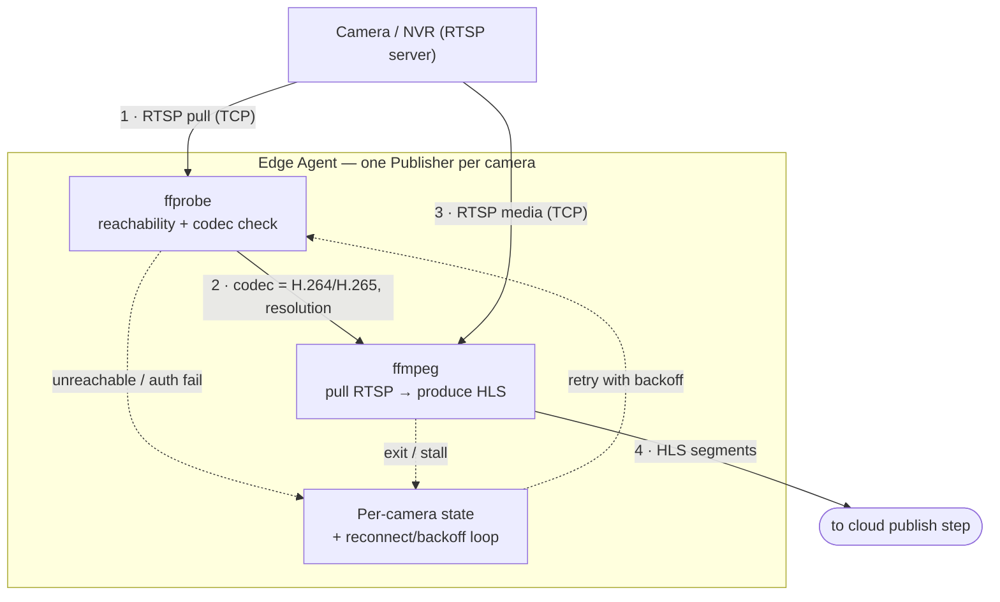

**What happens step by step:**

1. **Probe first.** For each camera the Publisher runs **ffprobe** against the RTSP URL with a **10-second timeout** to confirm the source is reachable and to read the video **codec** and resolution.
2. **Decide copy vs transcode.** If the source is **H.264**, ffmpeg **copies** the video with no re-encoding (cheap). If the source is **H.265/HEVC**, ffmpeg **transcodes to H.264** (browsers cannot play H.265 in HLS). This is the `auto` behaviour; it can be forced to `copy` or `h264` per camera.
3. **Publish.** ffmpeg pulls the RTSP media and writes an HLS stream (2-second segments, 6-segment sliding window), uploading each piece to the cloud (next section).

**Failure behaviour (all per-camera and isolated):**

- **Camera unreachable / network down:** ffprobe fails → the camera enters `OFFLINE` and the Publisher **retries with exponential backoff**.
- **Authentication failure (wrong RTSP username/password):** surfaces as a probe/ffmpeg error, classified as `auth`; the Publisher keeps retrying (it does not silently give up).
- **Reconnect / exponential backoff:** retry delay starts at **1 second** and doubles on repeated failure up to a cap (**`backoffMaxSeconds`, default 30s**). After a stream has run **stably for 30 seconds**, the backoff resets to 1s so a later blip recovers quickly.
- **Stall watchdog:** if ffmpeg is alive but produces **no output progress** within the stall window (**`watchdog.stallSeconds`, default 30s, clamped 15–120s**), that camera is marked `STALLED`, its ffmpeg is killed, and the normal reconnect loop restarts **only that camera**.
- **Isolation:** each camera is an independent goroutine with its own context, retry loop, ffmpeg process, and state. **One camera failing never stops another** — verified in a six-camera mixed-failure test where the healthy camera saw *0 disruptions* while four neighbours were failing.

---

## 7. Edge Agent Internal Software Architecture

The Edge Agent is written in Go. The **worker process** is the streaming engine; a separate **GUI process** is the operator console (see §13).

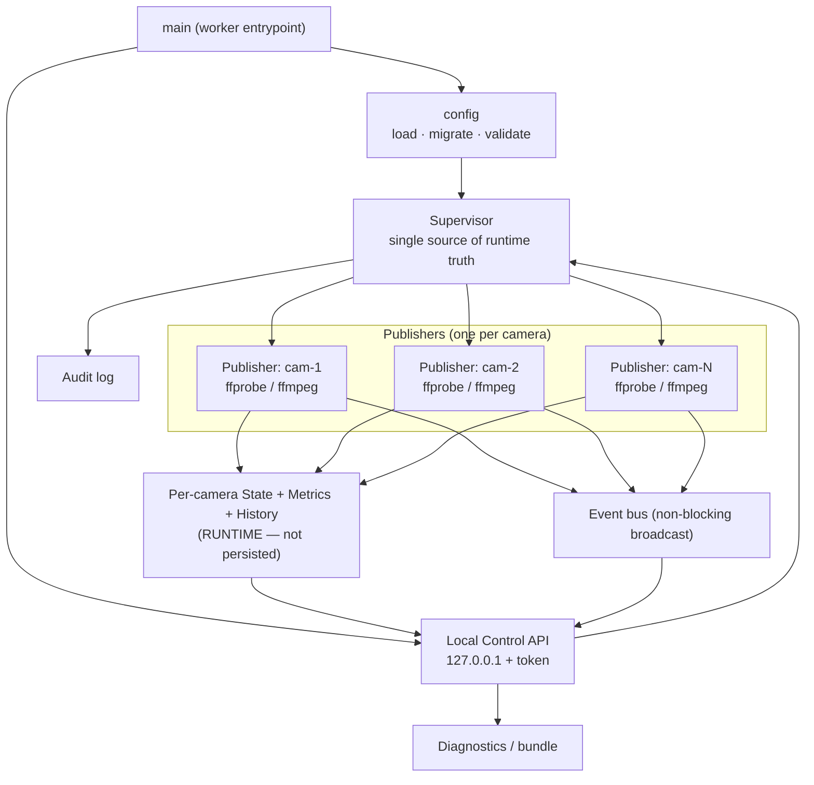

**Two kinds of state — kept strictly separate:**

- **Configuration state (persisted):** the `config.yaml` file — which cameras exist, their RTSP source, ingest target, token, and whether each is enabled. This is the *only* thing written to disk about intent.
- **Runtime state (never persisted):** each camera’s live status, reconnect count, last-seen time, health score, recent event/transition history. This lives only in memory and is **reconstructed on startup** from the enabled cameras in the config.

**Component responsibilities:**

| Component | Responsibility |
|---|---|
| `config` | Load, migrate (schema versioned), and validate `config.yaml`; refuse invalid configs. |
| `Supervisor` | Own every camera’s Publisher; start/stop cameras; single source of runtime truth. |
| `Publisher` | Run one camera: probe → ffmpeg → supervise → reconnect. |
| `State` | Per-camera status enum, metrics, bounded history (last 10 reconnects, last 20 transitions/bitrate samples). |
| Event bus | Non-blocking, drop-oldest broadcast of camera events (started/stopped/online/offline/reconnect/failed). |
| Audit log | Append-only record of lifecycle/operator actions. |
| Control API | Local HTTP API (127.0.0.1) the GUI uses to read state and issue commands. |
| Diagnostics | `/health`, `/version`, `/diagnostics`, and a redacted support bundle. |

---

## 8. Multi-Camera Concurrency Model

One Edge Agent runs **many cameras at once**. Each camera gets its **own goroutine** (a lightweight Go concurrency unit) running `Publisher.Run(ctx)`, its **own cancellable context**, its **own reconnect loop**, its **own ffmpeg child process**, and its **own state**.

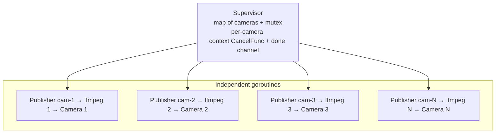

Because each camera is fully independent:

- A crash, stall, or unreachable source on one camera is **contained** to that camera’s goroutine and ffmpeg process.
- Starting or stopping one camera does not touch the others (see §13).
- Resource use scales **linearly and cheaply** with camera count on the agent side (see §20) — the agent overhead is small; the real cost is ffmpeg and bandwidth.

---

## 9. Video Data Flow: CCTV → Cloud → Browser

This is the full life of one video stream. **Read the protocol on each arrow carefully — the transport changes at the Edge Agent.**

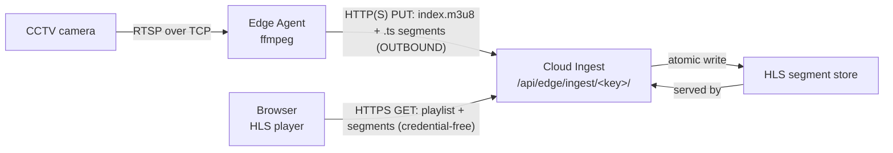

**Where the video actually travels over the Internet:**

- **Camera → Edge Agent:** RTSP/TCP, entirely **inside the customer LAN**. Never leaves the site.
- **Edge Agent → Cloud ingest:** the video crosses the Internet here, as **outbound HTTP(S) PUT** requests carrying HLS files. Each ~2-second segment plus the updated playlist is uploaded as it is produced.
- **Cloud ingest → Browser:** the browser fetches the same HLS files back over **HTTPS GET**. Playback is **credential-free** (the URL is what authorises access; RTSP credentials are never involved).

**Important cloud-side distinction (confirmed in code):** the Edge Agent path (**EDGE\_PUSH** mode) delivers video **through the SParking application’s own ingest route** (`/api/edge/ingest/…`), which stores the HLS files and serves them to the browser. In the current deployment this application — both the **portal** and the **ingest route** — is the **same Vercel app**; the agent publishes to and the browser fetches from that one application. This path **does not use MediaMTX**. MediaMTX is used only for the *separate* “cloud pulls RTSP directly” mode (**MEDIAMTX\_PULL**), which is **not part of the Edge Agent flow**. See §10 for why this separation matters to networking, and §24 for a deployment note on segment storage.

---

## 10. Networking Architecture

This section details the network paths, directions, and requirements, based on the implementation.

### 10.1 Customer network — where the Edge Agent lives

The Edge Agent runs on a customer machine **inside the camera LAN**. That LAN uses **private IP addressing**; the exact subnet is **deployment-dependent** (whatever the site uses). The agent needs a route to the cameras’ private IPs — which is exactly what being on the same LAN provides — and normal outbound Internet access.

### 10.2 Camera connectivity

- **Direction:** Edge Agent → Camera/NVR. The **Edge Agent initiates** the RTSP session.
- **Protocol/port:** RTSP over **TCP**. RTSP commonly listens on **TCP 554**; the exact port is whatever the camera/NVR uses and is embedded in the configured RTSP URL (**deployment-dependent / configurable**).
- **Credentials:** the RTSP username/password are embedded in the camera’s RTSP URL and stay in the **Edge Agent’s local config on the edge machine**. They are never sent to the cloud or the browser.

### 10.3 Internet connectivity

- **Direction:** Edge Agent → Cloud ingest, **outbound**.
- **Protocol:** HTTP(S) `PUT` (and `DELETE` for expiring segments). The publish URL is configured (e.g. `https://<portal-host>/api/edge/ingest/<streamKey>/index.m3u8`). Whether it is plain HTTP or HTTPS depends on the configured URL and deployment; the design is a standard HTTP method so it rides **any HTTPS reverse proxy or tunnel**.
- **Why NAT is not a problem:** NAT freely allows a device on the LAN to open **outbound** connections and receive the responses. Since the agent only ever dials **out**, the customer’s NAT/firewall passes it like any web traffic. No port-forward, no public IP.

### 10.4 Cloud-to-edge connectivity

**None is required.** The cloud never initiates a connection to the Edge Agent. All video and control that the cloud sees arrives as **inbound requests that the edge or the browser started**. There is **no inbound listener on the Edge Agent exposed to the Internet** — the only listener it runs is bound to **loopback (127.0.0.1)** for the local GUI (see §12–13).

### 10.5 NAT walkthrough

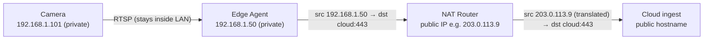

The router rewrites the agent’s private source address to the site’s public address on the way out and reverses it for responses — ordinary outbound NAT. The camera’s private IP never appears on the Internet.

### 10.6 Security boundary

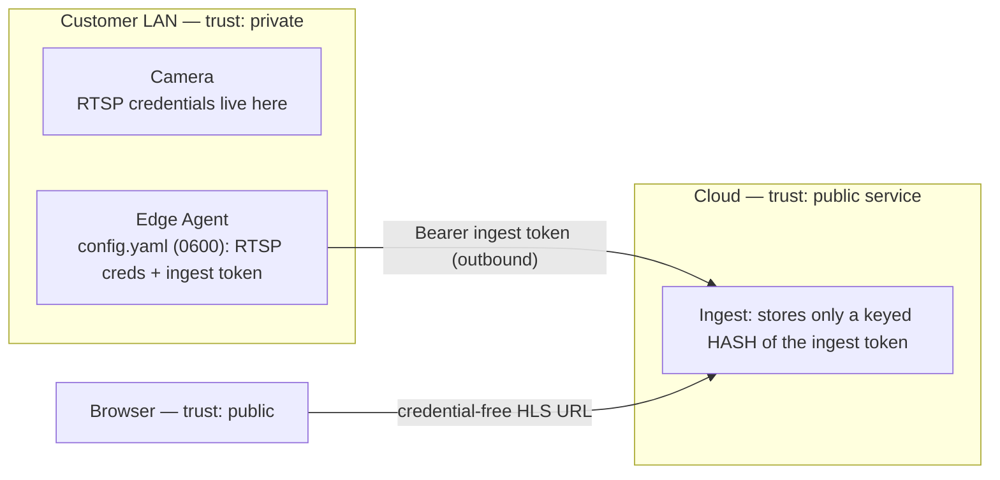

- **RTSP camera credentials:** never leave the edge machine.
- **Ingest token:** lives in the edge config; the cloud stores only a **keyed hash** of it and compares in constant time (a database leak alone cannot forge a token).
- **Browser:** only ever receives **credential-free** playback URLs.

---

## 11. Firewall / NAT / Port Requirements

**Inbound rules required at the customer firewall for the Edge Agent: none.**

The table lists only what the implementation and configuration confirm. Where a value depends on the site or the configured URL, it is marked accordingly rather than invented.

| Source | Destination | Protocol | Port | Direction | Purpose |
|---|---|---|---|---|---|
| Edge Agent | Camera / NVR | RTSP over TCP | Commonly **554**; **configurable** (from RTSP URL) | Outbound **within LAN** | Pull camera video |
| Edge Agent | Cloud ingest | HTTP(S) | **443** if the publish URL is `https://…`; otherwise the URL’s port (**configurable**) | **Outbound** to Internet | Publish HLS segments (PUT/DELETE) |
| Browser | Cloud portal | HTTPS | 443 (deployment-dependent) | Browser → cloud | Fetch credential-free playback URL |
| Browser | Cloud ingest | HTTPS | 443 (deployment-dependent) | Browser → cloud | Fetch HLS playlist + segments |
| GUI (same machine) | Edge Agent worker | HTTP | **OS-assigned**, bound to **127.0.0.1 only** | **Loopback (never leaves the machine)** | Local control API |
| Cloud | Edge Agent | — | — | **Not required** | No inbound connection to the edge |

Notes:

- **Camera RTSP port:** the code uses whatever the configured RTSP URL specifies. `554` is the common default but is not hard-coded.
- **Cloud ingest port:** the publish URL is configured per deployment. Verify the exact scheme/port from the deployment’s `portalBaseUrl` / publish URL.
- **Local control port:** the worker binds to `127.0.0.1` with an **OS-assigned port (port 0)** and writes the chosen address + token to a local `control.json` file for the GUI. It is a **loopback** listener — not reachable from the LAN or the Internet.
- **MediaMTX ports (`8554/8888/8889/9997`)** belong to the *separate* cloud-pull path and are **Not part of the current Edge Agent** flow (see §9).

---

## 12. Control Plane vs Data Plane

These two planes are physically and directionally different. Keeping them separate is central to the design.

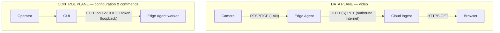

- **Data plane** crosses the Internet (outbound) and reaches browsers.
- **Control plane** is **entirely local to the edge machine** — the operator drives the GUI, which talks to the worker over loopback. **No control traffic traverses the Internet, and the cloud has no control channel into the agent.**

---

## 13. GUI ↔ Worker Architecture

The GUI and the streaming worker are **two separate processes**. This is deliberate: **closing the GUI must not stop streaming.** Only an explicit Stop (or a reboot without auto-start) stops the worker.

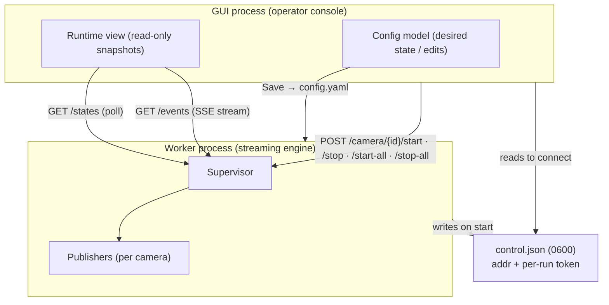

How it works:

- The worker binds a local HTTP **control API** on `127.0.0.1` and writes its address + a fresh **per-run token** to `control.json` (file mode `0600`). The GUI reads that file to connect. A new token is generated each run.
- The GUI **reads** runtime state two ways: **polling** `GET /states` and a **Server-Sent Events (SSE)** stream on `GET /events` for live pushes. SSE is a one-way, long-lived HTTP response the server uses to push events to the client.
- The GUI **issues commands** — `POST /camera/{id}/start`, `/camera/{id}/stop`, `/start-all`, `/stop-all` — which the Supervisor executes.
- The GUI never manipulates publisher internals directly; the **Supervisor is the single source of runtime truth**.

**Per-camera stop, proven isolated:** `StopCamera(5)` cancels *only* camera 5’s context; its ffmpeg child (launched via `exec.CommandContext`) is terminated and reaped before the call returns (**no orphaned processes**), while cameras 1–4 and 6–N keep publishing untouched. `running()` is tracked by a per-camera **done channel**, so a stop that races a start can never leave two goroutines on one camera.

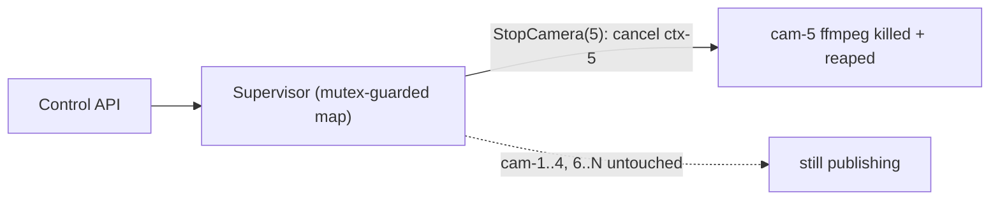

---

## 14. Runtime State Machine

Each camera has a live status inside the agent. This is the agent’s own fine-grained view (distinct from the portal’s coarser ONLINE/OFFLINE, which the portal derives from HLS playlist freshness). The full enum is defined in the implementation:

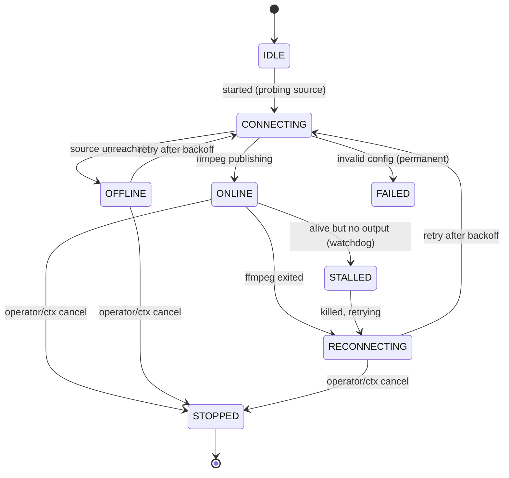

| State | Plain-English meaning |
|---|---|
| `IDLE` | Configured but not started yet. |
| `CONNECTING` | Probing the source for the first time (or after a retry). |
| `ONLINE` | ffmpeg is publishing successfully. |
| `OFFLINE` | Source is unreachable right now; will retry with backoff. |
| `RECONNECTING` | ffmpeg exited; backing off before the next attempt. |
| `STALLED` | ffmpeg is alive but produced no output; being killed and restarted (watchdog). |
| `STOPPED` | The operator or a shutdown asked it to stop. |
| `FAILED` | Stopped permanently, e.g. invalid configuration — will not auto-retry. |

A derived **health score (0–100)** summarises this for dashboards: `FAILED`→0, `OFFLINE`→20, `RECONNECTING`→40, `IDLE`/`STOPPED`→100 (not-running is not “unhealthy”); `ONLINE`/`CONNECTING` start at 100 and lose 8 points per reconnect in the last 10 minutes, floored at 30. It is a relative indicator, not a calibrated SLA metric.

---

## 15. Camera Failure / Reconnect / Watchdog Flow

**Normal failure and recovery** (network blip, camera reboot, brief cloud unavailability):

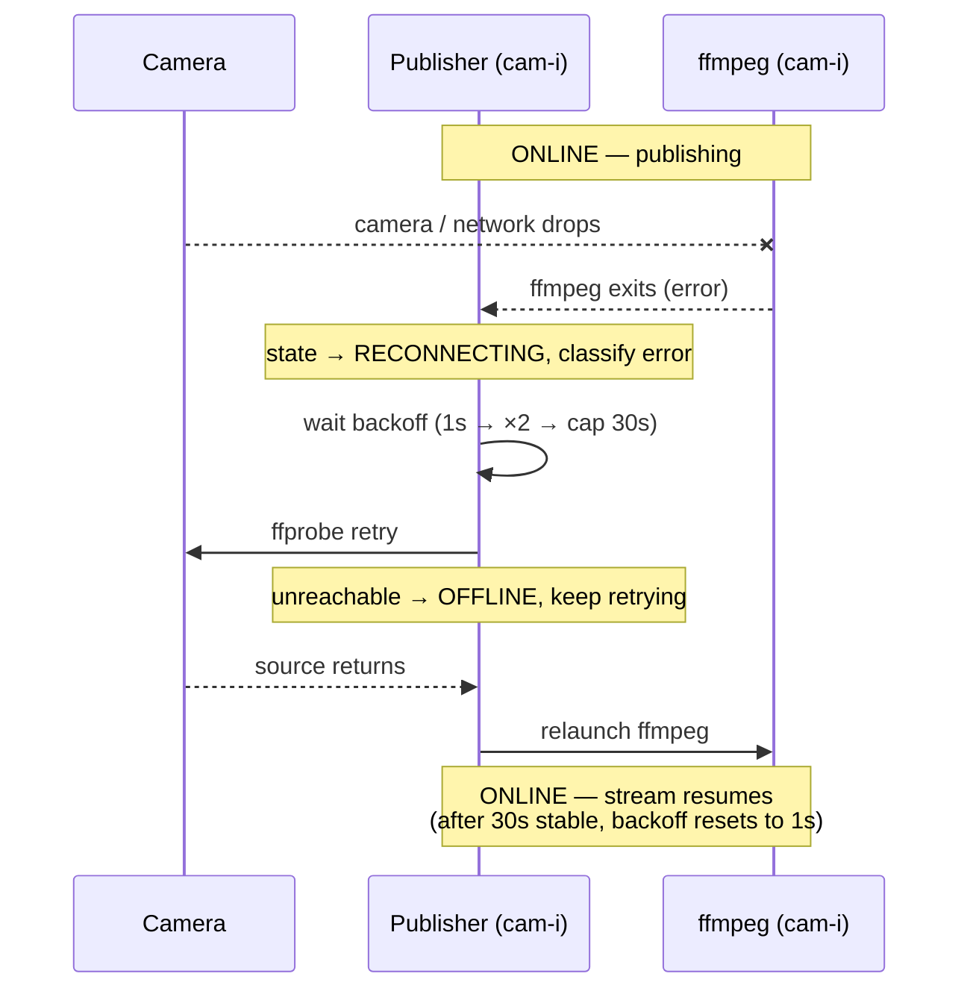

**Stall watchdog** (ffmpeg alive but frozen — no progress):

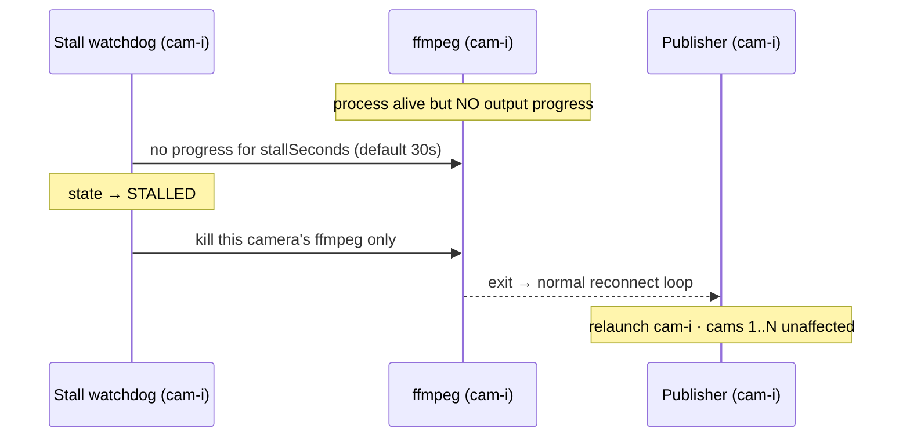

Key points:

- The watchdog’s signal is **ffmpeg process progress** (its stderr activity), **not** analysis of video content — so a genuinely healthy but low-motion stream is never falsely restarted.
- Every one of these behaviours is **per-camera**. The reconnect loop, the backoff timer, the watchdog, and the ffmpeg kill all target a single camera. Neighbours keep running.
- **If the Internet (cloud) is temporarily unavailable:** ffmpeg’s uploads fail, the camera cycles through reconnect/backoff, and it resumes publishing when connectivity returns — the same recovery path as a source blip.

---

## 16. Configuration & Startup

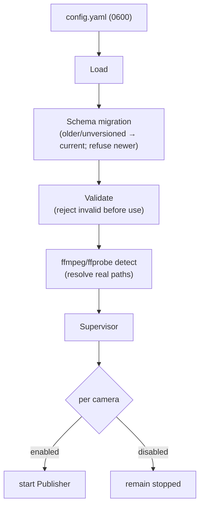

Policy, exactly as implemented:

- **Configuration is persisted; runtime state is not.** The only durable record of intent is `config.yaml`.
- **On startup, runtime is reconstructed from the config:** every **enabled** camera is started; every **disabled** camera stays stopped. There is no separate runtime file to restore or corrupt.
- **Schema is versioned** (`schemaVersion: 1`). Older/unversioned configs (including the original single-camera layout) are **migrated** forward on load; a config from a *newer* version than the agent understands is **refused** clearly rather than mis-parsed.
- **Validation is a gate:** an invalid config is rejected before it can take effect.

Config knobs relevant to operations (all optional; defaults shown):

```yaml
log:
  level: info        # debug | info | warn | error
  maxSizeMB: 5       # rotate a log when it exceeds this (default 5)
  maxBackups: 3      # rotated files kept (default 3)
watchdog:
  stallSeconds: 30   # stall watchdog window (default 30, clamped 15–120)
backoffMaxSeconds: 30 # reconnect backoff cap (default 30)
```

The application directory (holding `config.yaml`, logs, `control.json`) is per-OS: `%APPDATA%\SParking` (Windows), `~/Library/Application Support/SParking` (macOS), `~/.config/sparking` (Linux, honouring `XDG_CONFIG_HOME`).

---

## 17. Security Architecture

Only mechanisms actually present in the implementation are listed.

| Concern | How it is handled |
|---|---|
| **Camera (RTSP) credentials** | Embedded in the camera’s RTSP URL, stored only in the edge machine’s `config.yaml` (mode `0600`). Never sent to the cloud or browser. |
| **Cloud publish credential (ingest token)** | Per-camera Bearer token in the edge config; sent as `Authorization: Bearer …` on each upload. The cloud stores only a **keyed hash** and compares in constant time. |
| **Config redaction** | The diagnostics bundle includes a **redacted** config: ingest tokens, stream keys, and any credentials embedded in RTSP/publish URLs are replaced with `***REDACTED***`. |
| **No secrets in the diagnostics bundle** | Enforced by design and by security tests (including a planted-secret test) — the bundle carries the redacted config and log tails, never raw secrets. |
| **Local control API** | Bound to **127.0.0.1 only**; every request requires a **per-run Bearer token** written to `control.json` (`0600`). Not reachable from the LAN or Internet. |
| **Audit log** | Append-only record of lifecycle/operator actions (start/stop, config changes, etc.). |
| **pprof debug endpoint** | **Disabled by default.** Only enabled if the operator sets `EDGE_DEBUG_ADDR` (e.g. `127.0.0.1:6060`), used for live goroutine/heap inspection during troubleshooting. |
| **Network exposure** | The agent exposes **no Internet-facing listener**. Its only listener is loopback for the GUI. |

No encryption or authentication is implemented beyond the above. Whether the publish URL uses TLS depends on the configured URL and deployment.

---

## 18. Diagnostics & Operations

The worker exposes a small operational surface on the **local** control API. An operator (via the GUI, or `curl` against the loopback address + token) can inspect health and collect a support bundle.

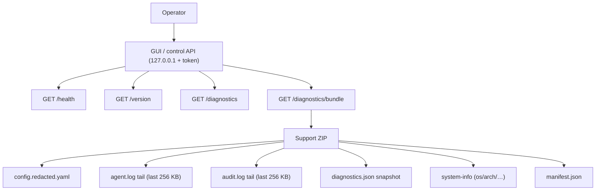

- **`/health`** — structured status with a per-camera breakdown (total / online / reconnecting / stalled / offline). Reports `degraded` if any camera is `FAILED`, `OFFLINE`, or `STALLED`, else `ok`.
- **`/version`** — agent, schema, and ffmpeg version info.
- **`/diagnostics`** — current camera state snapshot (history optionally included).
- **`/diagnostics/bundle`** — a single ZIP for support. It contains the **redacted** config, the tail (last 256 KB each) of the operational and audit logs, a diagnostics snapshot, system info, and a manifest. **It never contains secrets.**

---

## 19. Resilience Architecture

All items below are implemented and reflected in the code/tests.

| Mechanism | Behaviour |
|---|---|
| Independent reconnect | Each camera reconnects on its own; others unaffected. |
| Exponential backoff | Retry delay 1s, doubling on repeated failure. |
| Backoff cap | Capped at `backoffMaxSeconds` (default 30s); resets to 1s after 30s stable. |
| Stall watchdog | Frozen-but-alive ffmpeg is detected and that camera restarted (default 30s window). |
| Process cleanup | ffmpeg runs under `exec.CommandContext`; context cancel kills and reaps it. |
| No orphaned ffmpeg | Stop waits for the child to exit before returning. |
| Crash restart | Under a supervising service (`Restart=always` on systemd), the worker restarts automatically. |
| Power-loss recovery | On restart, enabled cameras are reconstructed from config and resume. |
| Atomic config writes | Config is written to a temp file then renamed — never a half-written file. |
| fsync on config write | The temp file is fsync’d before rename (and the directory after) so a full disk or power loss cannot leave a zero-length or false-success config. |
| Config lock | An advisory `config.lock` (10s timeout; stale lock >30s reclaimed) serialises writers. |
| Log rotation | `agent.log` and `audit.log` rotate at `log.maxSizeMB` (default 5 MB), keeping `log.maxBackups` (default 3) — disk never fills; rotation is disk-full-safe. |
| Diagnostics | Health/version/diagnostics endpoints + redacted support bundle. |
| Audit logging | Append-only operator/lifecycle trail. |

---

## 20. Capacity & Performance

The agent’s own overhead is small and linear. **The real constraints are physical and per-camera: ffmpeg CPU (for transcoding) and upload bandwidth — not the Go agent.**

### Copy mode vs Transcode mode

- **Copy mode (H.264 sources):** ffmpeg passes video through without re-encoding. CPU cost is minimal (~1.7% per stream in the measured setup). Many cameras per agent.
- **Transcode mode (H.265 → H.264):** required because browsers cannot play H.265 in HLS. This is CPU-intensive and **per camera** — the binding constraint at scale.

### Measured agent overhead (Phase-1 stress test, copy mode, 8-core Linux)

These numbers measure **agent overhead while all cameras publish**, using test RTSP sources:

| Cameras | Publishing | Agent RSS | OS threads | Goroutines |
|--------:|:----------:|----------:|-----------:|-----------:|
| 10 | 10/10 | 10 MB | 19 | 36 |
| 20 | 20/20 | 12 MB | 30 | 66 |
| 30 | 30/30 | 12 MB | 40 | 96 |

Goroutines scale ~linearly (~3/camera); agent RSS is essentially flat (~12 MB at 30) because the real memory lives in the ffmpeg child processes, not the Go supervisor.

### Scale/resilience test (agent structural overhead only)

A separate resilience test drove the supervisor to large camera counts to prove **no leaks and linear structural scaling**:

| Cameras | Goroutines | Open FDs | `/states` payload | Heap |
|--------:|-----------:|---------:|------------------:|-----:|
| 100 | +183 | 62 | 69 KB | 2 MB |
| 200 | +495 | 223 | 129 KB | 14 MB |
| 400 | +1311 | 805 | 212 KB | 21 MB |

This test exercises the **probe → offline → backoff path with synthetic/unreachable sources**. It demonstrates that the *agent's* goroutine/FD/memory footprint scales cleanly to 400 cameras with no leak. It does **not** represent 400 live H.265 streams being transcoded — live encoding capacity is CPU-bound and depends on hardware and codec.

### Practical capacity guidance (measured/estimated)

- **CPU:** H.264 (copy) → dozens of cameras per agent. H.265 (must transcode) → roughly **4–8 simultaneous 1080p transcodes** on a laptop before saturation *(estimate)*.
- **Upload bandwidth:** ~2–4 Mbps per 1080p stream; 30 cameras ≈ 60–120 Mbps up — usually a **site uplink** limit, not an agent limit *(estimate)*.
- **RAM:** ~30–50 MB per ffmpeg process (OS-managed), not agent heap *(estimate)*.
- Beyond one machine’s CPU/uplink: run **multiple independent Edge Agents**.

---

## 21. Architecture Validation / Testing Evidence

What has been tested, and what has not yet been run on production hardware.

### Functional — tested and proven

- Multi-camera concurrent publishing (10/20/30 cameras, all publishing).
- Independent failure / fault isolation (six-camera mixed-failure matrix: healthy camera saw **0 disruptions** while four neighbours failed).
- Reconnect and recovery (killed source recovered ~10s after it returned, matching backoff).
- Per-camera start/stop; disabled cameras do not auto-start; runtime reconstructed from config on restart.
- Configuration schema migration (legacy single-camera → current multi-camera) and import/export.

### Concurrency — tested and proven

- `go test -race` across the engine.
- A **real data race was discovered and fixed** during development (the start-vs-stop window in the supervisor).
- Supervisor lifecycle: concurrent start/stop/all spam runs race-clean with no goroutine leak.

### Scale — tested and proven (with the caveat above)

- 10 / 20 / 30 camera agent-overhead measurements (copy mode).
- 400-camera structural resilience test (synthetic sources; agent overhead only — **not** 400 live transcodes).

### Security — tested and proven

- Diagnostics redaction test (secrets stripped from the bundle).
- **Planted-secret test** confirming no secret leaks into the support bundle over the wire.

### Resilience — tested and proven

- Disk-full (ENOSPC) behaviour for config writes and log rotation; live config never corrupted.
- Read-only-directory behaviour for log rotation.
- Synthetic source-reboot chaos (repeated down/up cycles; isolation and recovery held).
- Stall watchdog isolation.
- Log rotation.

### Not yet tested on production hardware

- A full **48–72h soak on target hardware** (a harness exists and has been smoke-tested; a long real-hardware run is pending).
- **Real-network chaos** (packet loss/latency/DNS/ingest-down/camera reboot) against a real camera and real ingest (a harness exists for the operator to run).
- Steady-state CPU/FD with **~30 live encoders** on representative hardware.

The agent is not yet certified production-ready: the soak and real-network chaos runs above remain outstanding on target hardware.

---

## 22. End-to-End A–Z Flow

Only steps the implementation supports:

1. The customer installs the Edge Agent on a machine **inside the CCTV LAN**.
2. The agent loads its configuration (`config.yaml`), migrating and validating it.
3. The agent uses the configured RTSP URLs (direct, or built from an NVR template).
4. For each enabled camera, a Publisher connects to the camera over RTSP/TCP.
5. **ffprobe** checks reachability and reads the source codec/resolution.
6. **ffmpeg** copies (H.264) or transcodes (H.265→H.264) the stream into HLS.
7. The agent **publishes** the HLS segments outbound via HTTP(S) PUT to the cloud ingest endpoint (Bearer-authenticated).
8. The cloud ingest stores the segments and serves them.
9. The browser fetches a **credential-free** HLS playback URL from the portal, then pulls the HLS playlist + segments from the ingest endpoint.
10. The portal displays live video.
11. Runtime state (per-camera status, health, metrics) is monitored in-agent and readable via the local control API.
12. Failures trigger **per-camera** reconnect / backoff / watchdog recovery.
13. An operator can start/stop individual cameras (or all) through the GUI → local control API.
14. Diagnostics (`/health`, `/version`, `/diagnostics`, redacted bundle) can be collected on demand.

---

## 23. Common Questions

1. **Where is the Edge Agent physically installed?** On a customer machine inside the CCTV LAN.
2. **Why must it be inside the customer’s network?** RTSP to a private camera IP only works from within that LAN; the cloud cannot reach private IPs.
3. **Does the CCTV camera need a public IP?** No.
4. **Does the Edge Agent need a public IP?** No.
5. **Does the customer need to expose RTSP to the Internet?** No — RTSP stays inside the LAN.
6. **Does the customer need inbound firewall rules?** No. The agent only makes outbound connections.
7. **Which direction does video traffic flow?** Camera→agent (LAN), then agent→cloud (outbound Internet), then cloud→browser.
8. **Which component initiates the connection?** The Edge Agent (to the camera, and to the cloud). The browser initiates its own requests to the cloud.
9. **What protocols are used?** RTSP/TCP (camera), HTTP(S) PUT (publish), HTTPS GET (browser playback of HLS).
10. **What ports are used?** Camera RTSP commonly TCP 554 (configurable); cloud publish typically 443 if HTTPS (configurable); browser 443; local control API on 127.0.0.1 (OS-assigned). See §11.
11. **How does NAT affect the design?** It doesn’t block it — outbound connections pass NAT normally; no inbound mapping is needed.
12. **What happens if one camera goes offline?** Only that camera reconnects with backoff; others are unaffected.
13. **What happens if the Internet goes down?** Uploads fail and cameras cycle through reconnect; they resume when connectivity returns.
14. **What happens if ffmpeg crashes?** The Publisher detects the exit and relaunches after backoff (for that camera only).
15. **What happens if the Edge Agent restarts?** Enabled cameras are reconstructed from config and resume; disabled ones stay stopped.
16. **What happens after power loss?** Same as restart; config writes are atomic + fsync’d, so the config is never corrupted.
17. **How does one Edge Agent handle multiple cameras?** One independent goroutine + ffmpeg per camera.
18. **What is the bandwidth requirement?** ~2–4 Mbps per 1080p stream (upload), site-dependent *(estimate)*.
19. **What is the CPU bottleneck?** H.265→H.264 transcoding; H.264 copy is cheap.
20. **Is the Edge Agent exposed to the Internet?** No — its only listener is loopback (127.0.0.1).
21. **How is the local control API protected?** Loopback binding + per-run Bearer token in a `0600` file.
22. **How are camera credentials protected?** They stay in the local `0600` config and never leave the site.
23. **How are diagnostics sanitized?** The bundle carries a redacted config and log tails; secrets are stripped (tested).
24. **What happens if the cloud is temporarily unavailable?** Uploads retry with backoff; streaming resumes on recovery.
25. **What is the recovery behavior?** Per-camera reconnect/backoff plus a stall watchdog, all isolated.

---

## 24. Current Limitations / Explicit Non-Goals

The following are **Not part of the current Edge Agent**:

- **No inbound/remote control from the cloud.** The cloud cannot command the agent; control is local only.
- **No WebRTC / WHIP / TURN / STUN / UDP** in the Edge Agent path. The transport is HLS-over-HTTP-PUT. (WebRTC exists only as an optional playback mode on the *separate* MediaMTX pull path — not the edge path.)
- **No MediaMTX in the edge path.** Edge video flows through the application’s `/api/edge/ingest/` route, not MediaMTX. MediaMTX/`8554/8888/8889/9997` belong to the separate cloud-pull mode.
- **No VPN, no Kubernetes, no MQTT, no Redis/Kafka, no cloud-side video processing** anywhere in this design.
- **Reserved-but-inactive fields:** `FPS`, `BitrateKbps`, `RecordingStatus`, `AIStatus`, `EdgeLatencyMs` exist in the state snapshot but are zero/unused today. Camera **capabilities** (PTZ/audio/recording/AI) are optional config hints, default false, **not auto-detected and not acted upon**.
- **Group-scoped control**, short-lived scoped playback tokens, and interchange/AI features are future work and **not part of the current agent**.

**Hosting.** In the current deployment the **portal/application backend** and the **video ingest route** (`/api/edge/ingest/…`) are served by the **same Vercel application**. The Edge Agent publishes to that application, and browsers fetch both the playback URL and the HLS media from it. The publish/playback base is still configured per deployment (`portalBaseUrl` / `EDGE_INGEST_PUBLIC_BASE`), so the exact hostname is deployment-specific, but portal and ingest are not separate infrastructure here — they are one app.

**Deployment note on segment storage (verify for production):** the ingest route stores HLS segments via a filesystem write (`EDGE_INGEST_DIR`, default `./.edge-hls`). Vercel’s serverless runtime provides only an **ephemeral, per-invocation filesystem** that is not shared between invocations and does not persist. A single Vercel app therefore serves the portal and ingest **route code** correctly, but whether HLS segments written by one request are reliably readable by a later playback request depends on the runtime/storage backing that path in production. This is a deployment/storage consideration to confirm — it is **not** a property of the Edge Agent itself, which simply performs outbound HTTP `PUT`/`DELETE` to the configured URL regardless of how the cloud stores the segments.

---

## 25. Glossary

| Term | Meaning |
|---|---|
| **LAN** | Local Area Network — the private network at the customer site. |
| **Private IP** | An address (e.g. `192.168.x.x`) usable only inside a LAN, not routable on the public Internet. |
| **NAT** | Network Address Translation — the router rewrites private↔public addresses; permits outbound, blocks unsolicited inbound. |
| **CGNAT** | Carrier-Grade NAT — an extra ISP-level NAT that makes inbound port-forwarding impossible. |
| **Firewall** | Filters network traffic; here, the customer firewall needs **no** inbound rule for the agent. |
| **Outbound connection** | Initiated from inside the LAN toward the Internet — always allowed through NAT. |
| **Inbound connection** | Initiated from the Internet toward the LAN — **not used** by this design. |
| **RTSP** | Real-Time Streaming Protocol — how IP cameras expose live video; pulled here over TCP. |
| **TCP** | Reliable, connection-oriented transport; RTSP is pulled over TCP for firewall resilience. |
| **HTTP / HTTPS** | Web request protocols; the agent publishes with HTTP(S) `PUT`. |
| **HLS** | HTTP Live Streaming — video delivered as a playlist (`.m3u8`) + short segments (`.ts`), fetched over HTTP; universally playable in browsers. |
| **HLS-over-HTTP-PUT** | The agent’s transport: ffmpeg writes HLS files and uploads each via HTTP `PUT`. |
| **Polling** | The GUI repeatedly asking the worker for current state (`GET /states`). |
| **SSE** | Server-Sent Events — a long-lived HTTP response the worker uses to push events to the GUI. |
| **localhost / loopback (127.0.0.1)** | The machine’s internal-only address; a listener bound here is unreachable from the LAN or Internet. |
| **Control API** | The worker’s local HTTP interface for the GUI (loopback + token). |
| **goroutine** | A lightweight Go concurrency unit; the agent runs one per camera. |
| **Supervisor** | The component owning all cameras’ lifecycles and the single source of runtime truth. |
| **ffprobe / ffmpeg** | Tools the agent uses to probe the source codec and to pull/publish the stream. |
| **EDGE_PUSH / MEDIAMTX_PULL** | The two cloud source modes; the Edge Agent is EDGE_PUSH. MEDIAMTX_PULL is separate and not part of the edge path. |
