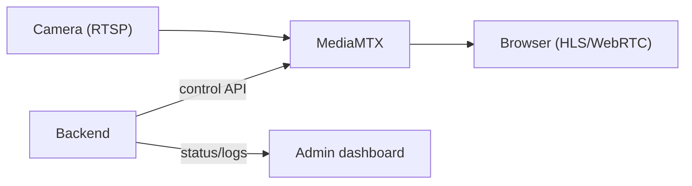
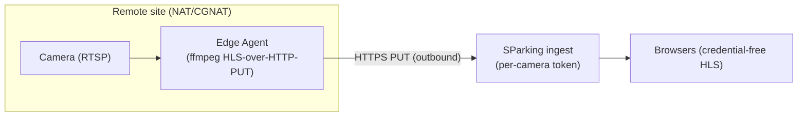
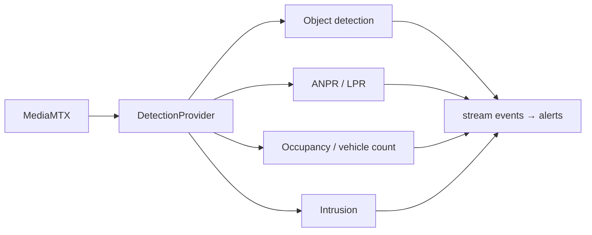
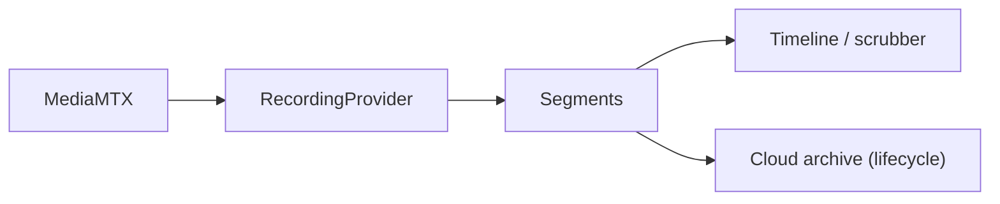

# CCTV — Future Architecture

CCTV is one capability of the Smart Parking platform. The streaming layer is
built on interfaces (`src/lib/streaming/providers.ts`) so the features below slot
in without rewriting business logic. This document is the roadmap and the map of
which seams each phase plugs into.

## Phase 1 — LAN streaming (this milestone) ✅

Backend pulls RTSP into MediaMTX; credential-free HLS/WebRTC to the browser;
health worker + connection logs. Works when the server can reach the camera.

## Phase 2 — Cloud/edge ingest (cameras behind NAT/CGNAT)

The hard problem: cameras sit on private LANs the cloud cannot reach inbound
(NAT, and especially **CGNAT**, make "cloud connects to camera" impossible for a
large fraction of sites). The rule: **the site must reach OUT to us.**

**Status: IMPLEMENTED** (`edge-agent/` + `/api/edge/ingest`, see
[edge-agent.md](edge-agent.md)). The transport is **HLS-over-HTTP-PUT**, not
WHIP. WHIP was the intuitive first choice, but WebRTC media can't cross NAT
through an HTTP tunnel, and the free ngrok tier offers no TCP tunnel for
RTSP/RTMP/SRT ingest. The design that actually works: the on-site agent's ffmpeg
writes HLS and **uploads segments over outbound HTTP PUT** — ordinary HTTP that
rides any HTTPS reverse proxy/tunnel, with no public IP, WebRTC, UDP, or TURN.

- **Seam used:** the `EdgeProvider` `StreamProvider` implementation — the
  backend, routes, health worker, and UI are unchanged; provider selection is by
  `Camera.sourceMode` (`MEDIAMTX_PULL` vs `EDGE_PUSH`).
- **Fan-out:** the ingest serves many browsers from the uploaded segments; the
  camera uplink carries a single outbound stream. Object storage + CDN in front
  of the ingest is the horizontal-scale step.
- **Phase 2C hardening (not yet done):** replace credential-free-by-URL playback
  with **short-lived, scoped playback tokens** minted by the backend, so a
  playback URL is not a permanent key.

## Phase 3 — AI analytics

- **Seam:** `DetectionProvider` (interface defined now). Wraps SParking's
  existing `DetectionEvent` model + AI pipeline (DL-Streamer / OpenVINO, Milvus
  vehicle-image search) already present in the repo.
- Detections publish onto the same `events.ts` bus → power alerts and live
  overlays without new plumbing. Ties directly into parking occupancy detection,
  vehicle counting, and ANPR-driven token matching.

## Phase 4 — Recording, playback & archive

- **Seam:** `RecordingProvider` (interface defined now). MediaMTX can record
  segments natively; the provider exposes start/stop/list/get so a timeline UI
  and cloud archival policy layer on top.

## Event-based alerts (cross-cutting)

`NotificationProvider` (interface defined now) fronts SParking's existing
`Notification` model / email / Socket.IO. Any phase can raise alerts (camera
offline, intrusion, overstay, occupancy threshold) by emitting a stream event
and letting a notification consumer deliver it.

## Why the abstractions now

Defining `StreamProvider` (implemented), plus `Recording/Detection/Notification`
(interfaces), is a small upfront cost that lets us later swap MediaMTX for a
cloud service (AWS Kinesis Video, Azure Video Indexer) or an on-prem VMS
(Milestone, Nx Witness), and add AI/recording/edge — **without changing the
camera business logic, API routes, or UI.**
